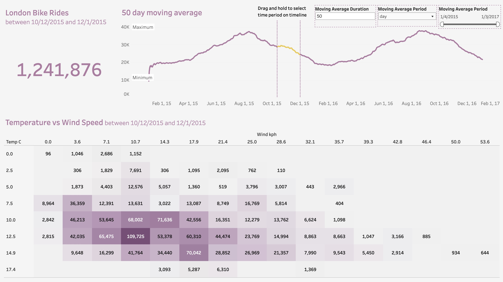

# London Bike Sharing Analysis


# Key findings:

## Table of Contents

- [Results](#results)
- [Dataset](#dataset)
- [Tools](#tools)
- [Code Example](#code-example)
- [Author](#author)

## Results



- [Tableau Dashboard](https://public.tableau.com/views/Book1_16908382045990/LondonBikeRides?:language=en-US&publish=yes&:display_count=n&:origin=viz_share_link)

## Dataset

- [Kaggle London Bike Sharing Dataset](https://www.kaggle.com/datasets/hmavrodiev/london-bike-sharing-dataset)
- Powered by TfL Open Data
- Contains OS data © Crown copyright and database rights 2016 and Geomni UK Map data © and database rights 2019

## Tools

- Python
- Pandas
- Jupyter Notebook
- Excel
- Tableau

## Code Example

```python
# create season and winter dicts to change numbers to str values
season_dict = {
    '0.0': 'Spring',
    '1.0': 'Summer',
    '2.0': 'Autumn',
    '3.0': 'Winter'
}

weather_dict = {
    '1.0': 'Clear',
    '2.0': 'Scattered Clouds',
    '3.0': 'Broken Clouds',
    '4.0': 'Cloudy',
    '7.0': 'Rain',
    '10.0': 'Rain with Thunderstorms',
    '26.0': 'Snowfall'
}

# change column data type and values to updated values
bikes.season = bikes.season.astype('str')
bikes.season = bikes.season.map(season_dict)

bikes.weather = bikes.weather.astype('str')
bikes.weather = bikes.weather.map(weather_dict)
```

## Author

John Lombardi

- [Portfolio](https://johnlombardi389.github.io/portfolio/)
- [LinkedIn](https://www.linkedin.com/in/johnlombardi389/)
- [GitHub](https://github.com/johnlombardi389)
